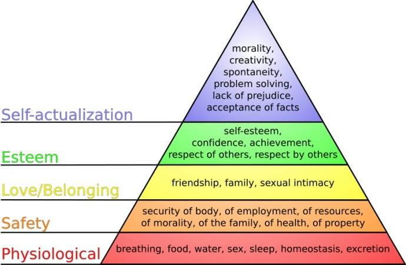

单从题目来看，这本书像是一个教你如何说话，如何与人沟通的书籍。其实题目没有错，但对“沟通”这个词的理解可以再放大一点。沟通可以用语言，可以用眼神，可以用动作。。。等等等等。还有我们常常忽略掉的，与自己的沟通，思想和内心的沟通。

#### 充满套路的社会，让我们渴望真诚，所以教人“话术”的书是不是在教人套路？

读完之后才发现，恰恰相反，这本书反而是在教我们如何自信，如何恰当得真诚，做自己。如果说是套路的话，也是对自己的套路。

## 一、什么是非暴力沟通

> 基于需要的意识！！！

这七个字就是非暴力沟通的定义。当你做或者不做某事时，都是为了满足自己的某个需要。

## 二、理论依据

心理学有四大流派：精神分析学派、行为主义学派、人本主义学派以及认知主义学派。非暴力沟通的作者马歇尔博士，师从人本主义心理学之父卡尔·罗杰斯，并且是没过威斯康星大学临床心理学博士。

人本主义心理学的另一个创始人马斯洛，因为马斯洛需求层次理论被大家熟知。


马歇尔博士基于需求，将这个理论更加平民化。

## 三、要怎么做

#### 从意识层面 
  非暴力沟通试图告诉我们：不是他人做的什么事，而是你对待它的方式，可能会伤害到你。我们的感受源自我们的需要。

#### 日常生活中如何践行？
  - 首先，要精神纯粹。我的理解就是要做自己，这第一步就充满了难度。书中提到了一些具体的办法，比如冥想、祈祷或者停顿，这些让自己**慢下来**的方法。
  - 其次，练习，练习再练习。当有一些感受在自己身体发生时，试着感受它，倾听内心深处的需要。
  - 参加非暴力沟通的线下小组，我生活在一个爱评判的世界里，在身边创造一个非暴力沟通的小世界大有裨益。

#### 再具体到话术

非暴力沟通也帮我们提供了一套话术，去表达我们的需要。但是不要本末倒置，只去追求话术，而不去理解它真正的内涵，结果可能适得其反，让人感觉非常的不真诚。

下面就是非暴力沟通的四要素：

- 观察 （而不是评判）
- 感受  (而不是想法)
- 需要
- 请求 （而不是命令）

非暴力沟通提倡我们通过这四个步骤，去表达我们的需要。清楚表达自己现在的状态，不带责怪和批评；理解、接纳自己的真实状态，不带责怪和批评

### 观察
  
  注意区分观察和评判。如果你不知道两者的区别的话，试着读一下下面的句子，你能区分哪些是观察，哪些是评判吗？

  1. 你昨天来得太晚了
  2. 他是个十分成功的车手
  3. 我现在没心情开玩笑
  4. 你说话声音太大了
  5. 你的房间终于干净了
  6. 王星昨天跟我说：“老李，你可真好” 
  7. 丽莎总是想着自己，非常的自我
  8. 我昨天晚上再卫视台看了“好声音”节目

 你能区分么，在我看来除了6和8，其他的句子都是带着评判性质的。

  倾听是观察非常重要的方式，在倾听的时候我们要知道，这并不需要我们同意每个人的观点，也不意味着我们必须喜欢他们说的话。这只是意味着，我们将自己在场这个珍贵的礼物赠予他们：此时此刻我们关注他们内心的想法，对此感兴趣，真正地感兴趣——不是作为一种心理学技巧，而是因为我们想与他们此时此刻内心的信仰相联系。
 
  这里的倾听不光是倾听别人，也要倾听自己。

### 感受

注意区分感受和想法：  
 感受是指情感、身体感觉、心情或精神状态  
 想法是我们队他人状态的判断

```
 我感到害怕和孤独
         —— 我们实际的情感体验
 我被抛弃了
         —— 别人怎么对我的想法
```
主义

### 需要

发现自己的需要是非暴力沟通的关键，我们习惯中的方式也往往会忽略掉这一部分。文末有一个基础的需要词汇表，我们可以平时多多观察，去留意自己做或者不做某件事情是为了满足自己的哪个需求。

一个很重要的点是，需要是和自己相关的而不是第三者。这里的需要是一个名词而不是动词，是我的需要，不是我需要你。

### 请求

告诉对方你想要的，而不是你不想要的。书中有一个例子：一个妈妈在休息时，小孩一直在敲他的书本，妈妈就对小孩说，你能不能不要再敲自己的书了。孩子听了之后，立马停下来，改敲自己的桌子。
### 综合起来的句子是

1. 同理自己时：

	当我（看到、听见）...... ，  
	我感觉...... ，  
	因为我需要/看重 ..... ，  
	你愿意......吗？

2. 同理他人时：

	当你（看到、听见）...... ， （表达理解时可以不说） 
	你感觉...... ，  
	（是）因为你需要/看重 ..... （吗？），  
	你愿意......吗？（表达理解时可以不说）

当然句子是程序式的，非暴力不鼓励人们生硬地使用这些句式，而是希望通过这几个步骤，去锻炼你对待一件事的方式。试着用着四步代替下意识地指责（别人或者自己）和命令，而是去理解自己或者他人更深层次的需要，我想这会让我们更加包容，继而更加轻松。

## 四、举个例子

非暴力沟通又提到，当我们建立起了有效的链接之后，在事件的当下，我们可以不用这么表达。因为，很少人能像圣人一样，做到不生气，尤其面对自己在乎的人或者在乎的事。我们做的是在生气之后，通过非暴力沟通去建立有效的链接。

比如，早上孩子懒床不想上学，在事情的当下，你可以掀起被子，给他屁股一巴掌，然后让他麻利儿的。如果你和孩子有高品质的链接，这对他来说不算什么。这个事情可能对你们的关系造成了损害，用满分💯来表示你们的关系满分的话，早上之后，你们的关系可能由80 -> 60。不要紧，事后，比如孩子放学回来之后，你再和孩子做一次非暴力的沟通。像这样：孩子，你愿意和我聊一聊今天早上的事情吗。今天早上我看到你7点半还躺在床上，我感到很生气和着急，因为我看中效率，那以后可以在爸爸叫你起床之后，你就能快速起床吗。孩子可能也会表达他的需要，比如需要休息，那我们就可以想办法，是不是可以前一天早一点休息。总而言之，不要让这个事情不了了之，这样一番沟通，你们的关系可能会由60 -> 70,通过一次次的非暴力沟通，你们的关系可以再增长到80，甚至更高。这时候你在生气的当下就又可以愉快地“打”孩子了，所以不要害怕链接分降低，关键是有办法让链接分数再次上升。

不要太对你们两个的关系不自信，当自己有情绪的时候也不要害怕表达，准确发现自己的需要，然后表达出来，最后提出自己的请求，这个过程并不是不可理喻的。

## 五、附录
<table>
		<tr>
			<td colspan="2" style="text-align:center">人类共有的基本感受</td>
		<tr>
		<tr>
			<td>需要得到满足时的感受</td>
			<td>需要未得到满足时的感受</td>
		<tr>
		<tr><td>惊奇</td><td>生气</td><tr>
		<tr><td>舒服</td><td>恼火</td><tr>
		<tr><td>自信</td><td>忧虑</td><tr>
		<tr><td>急切</td><td>困惑</td><tr>
		<tr><td>振奋</td><td>失望</td><tr>
		<tr><td>满足</td><td>灰心</td><tr>
		<tr><td>高兴</td><td>痛苦</td><tr>
		<tr><td>希望</td><td>尴尬</td><tr>
		<tr><td>鼓舞</td><td>泄气</td><tr>
		<tr><td>好奇</td><td>无助</td><tr>
		<tr><td>喜悦</td><td>无望</td><tr>
		<tr><td>感动</td><td>急躁</td><tr>
		<tr><td>乐观</td><td>恼怒</td><tr>
		<tr><td>自豪</td><td>孤独</td><tr>
		<tr><td>释然</td><td>紧张</td><tr>
		<tr><td>亢奋</td><td>惊惶</td><tr>
		<tr><td>惊喜</td><td>迷惑</td><tr>
		<tr><td>感恩</td><td>勉强</td><tr>
		<tr><td>触动</td><td>悲伤</td><tr>
		<tr><td>信任</td><td>不安</td><tr>
	</table>

<table>
		<tr>
			<td colspan="2" style="text-align:center; font-weight:bold">人类共有的基本需要</td>
		<tr>
		<tr>
			<td colspan="2" style="text-align:center; font-weight:bold">自主</td>
		<tr>
		<tr>
			<td>选择自己的梦想、目标和价值感</td>
			<td>选择实现这些梦想、目标和价值观的计划</td>
		<tr>
		<tr>
			<td colspan="2" style="text-align:center; font-weight:bold">纪念</td>
		<tr>
		<tr>
			<td>庆祝生命的创造和梦想的实现</td>
			<td>哀悼失去挚爱之人、梦想破灭等</td>
		<tr>
		<tr>
			<td colspan="2" style="text-align:center; font-weight:bold">人格健全</td>
		<tr>
		<tr>
			<td style="text-align:center">真诚</td>
			<td style="text-align:center">意义</td>
		<tr>
		<tr>
			<td style="text-align:center">创造力</td>
			<td style="text-align:center">自我价值</td>
		<tr>
		<tr>
			<td colspan="2" style="text-align:center; font-weight:bold">互相依存</td>
		<tr>
		<tr>
			<td style="text-align:center">接纳</td>
			<td style="text-align:center">城市（让我们能从自己的缺陷中学习的诚实）</td>
		<tr>
		<tr>
			<td style="text-align:center">欣赏</td>
			<td style="text-align:center">爱</td>
		<tr>
		<tr>
			<td style="text-align:center">亲近</td>
			<td style="text-align:center">安心</td>
		<tr>
		<tr>
			<td style="text-align:center">共享</td>
			<td style="text-align:center">尊重</td>
		<tr>
		<tr>
			<td style="text-align:center">体贴</td>
			<td style="text-align:center">支持</td>
		<tr>
		<tr>
			<td style="text-align:center">为丰盈的生命做共享（通过有益于生命的奉献来锻炼自己的能力）</td>
			<td style="text-align:center">信任</td>
		<tr>
		<tr>
			<td style="text-align:center">情感安全</td>
			<td style="text-align:center">理解</td>
		<tr>
		<tr>
			<td style="text-align:center">换位思考</td>
			<td style="text-align:center">温暖</td>
		<tr>
		<tr>
			<td colspan="2" style="text-align:center; font-weight:bold">滋养身体</td>
		<tr>
		<tr>
			<td style="text-align:center">空气</td>
			<td style="text-align:center">休息</td>
		<tr>
		<tr>
			<td style="text-align:center">食物</td>
			<td style="text-align:center">性表达</td>
		<tr>
		<tr>
			<td style="text-align:center">活动和运动</td>
			<td style="text-align:center">住所</td>
		<tr>
		<tr>
			<td style="text-align:center">防御措施，免于病毒、细菌、昆虫、捕食性动物等的威胁</td>
			<td style="text-align:center">抚爱</td>
		<tr>
		<tr>
			<td style="text-align:center"></td>
			<td style="text-align:center">水</td>
		<tr>
		<tr>
			<td colspan="2" style="text-align:center; font-weight:bold">玩耍</td>
		<tr>
		<tr>
			<td style="text-align:center">乐趣</td>
			<td style="text-align:center">欢笑</td>
		<tr>
		<tr>
			<td colspan="2" style="text-align:center; font-weight:bold">心灵契合</td>
		<tr>
		<tr>
			<td style="text-align:center">美</td>
			<td style="text-align:center">秩序</td>
		<tr>
		<tr>
			<td style="text-align:center">和谐</td>
			<td style="text-align:center">和平</td>
		<tr>
		<tr>
			<td style="text-align:center">灵感</td>
			<td style="text-align:center"></td>
		<tr>
	</table>